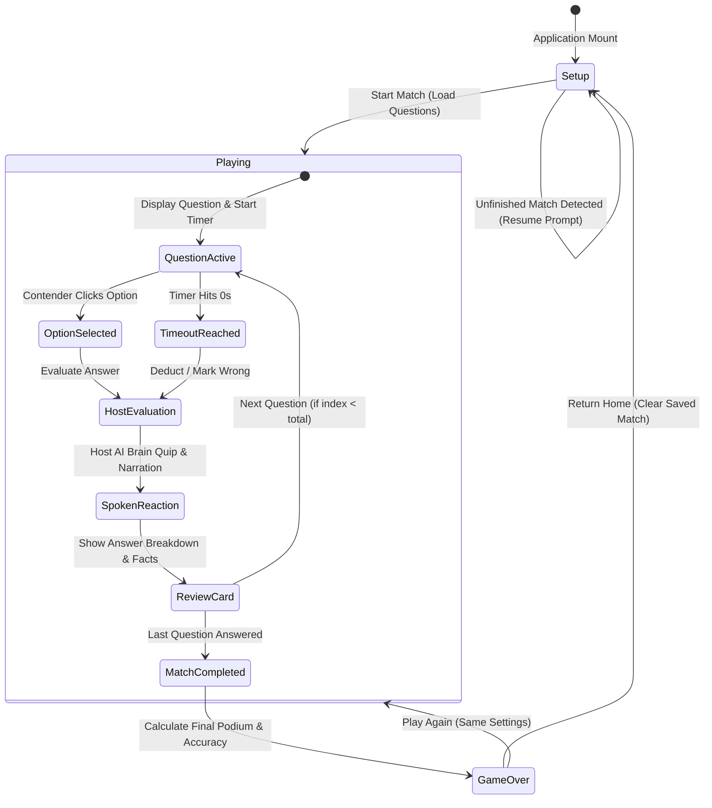
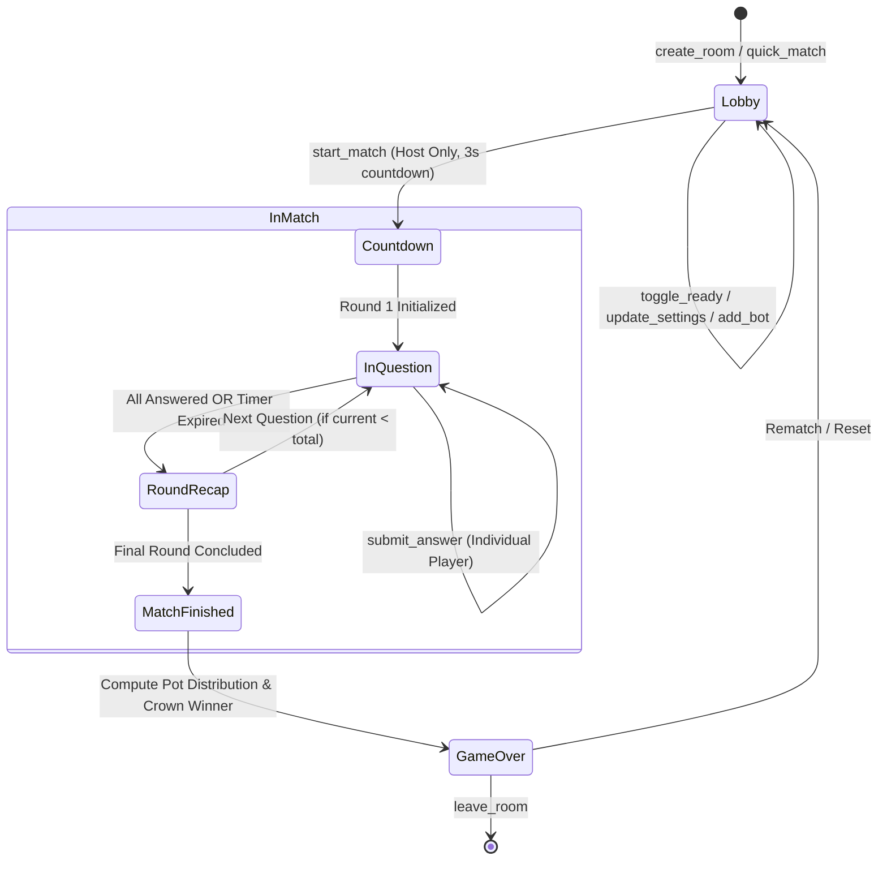
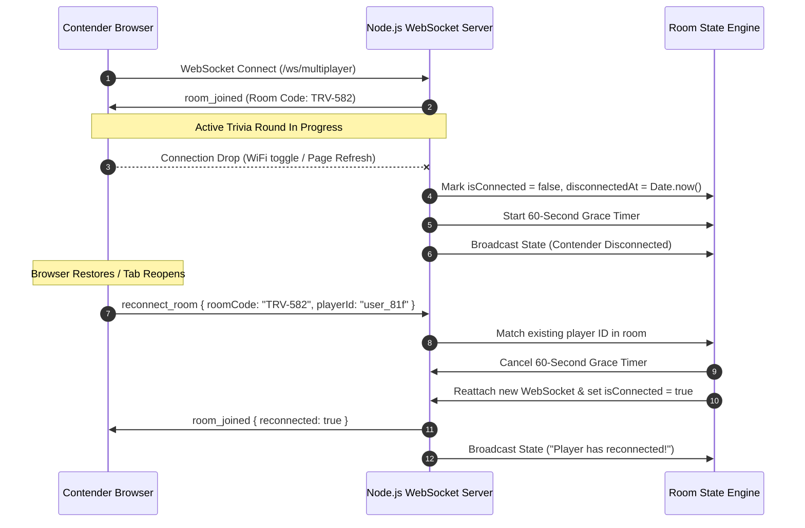

# Architecture & Design Specifications: Snap Crackle Pop Trivia 💥⚡🍿

This document outlines the architecture, mathematical scoring models, state diagrams, data flows, and fault-tolerant mechanisms powering **Snap Crackle Pop Trivia**.

---

## 1. High-Level System Architecture

Snap Crackle Pop Trivia is engineered as an **offline-resilient, hybrid client-server application**. The system operates with zero external API dependencies during gameplay while providing optional cloud-enhanced features (such as live search grounding and dynamic AI prompt generation) when credentials are present.

```
┌─────────────────────────────────────────────────────────────────────────────┐
│                          CLIENT (React 19 + Vite 6)                         │
├─────────────────────────────────────────────────────────────────────────────┤
│  • App State & Auto-Save Session Storage (localStorage crash resilience)    │
│  • Local Host AI Brain (hostBrain.ts - 0ms contextual banter & roasts)     │
│  • Hardware Web Speech Synthesis (Character pitch/rate audio synthesis)     │
│  • Canvas Confetti, Framer Motion animations & Tailwind CSS v4 UI           │
└───────────────────────┬─────────────────────────────▲───────────────────────┘
                        │ HTTP / JSON                 │ WebSocket (/ws/*)
                        ▼                             ▼
┌─────────────────────────────────────────────────────────────────────────────┐
│                        BACKEND (Express 4 + Node.js)                        │
├─────────────────────────────────────────────────────────────────────────────┤
│  • Request Logging & Winston Structured Transports (logs/combined.log)      │
│  • Input Validation & Sanitization Middleware (server/middleware/*)         │
│  • 3-Tier Question Pipeline (Local 500-Q Weekly Bank -> OTDB -> Gemini)     │
│  • Multiplayer Room State Engine with 60s Disconnect Grace Period           │
│  • Heartbeat Keepalive (Ping/Pong 20s interval)                             │
│  • File-backed Leaderboard Store (data/leaderboard.json)                    │
└─────────────────────────────────────────────────────────────────────────────┘
```

---

## 2. State Machine Diagrams

### 2.1 Single-Player Match Lifecycle

The single-player engine transitions through discrete game phases, maintaining continuous state synchronization with local persistent storage.



---

### 2.2 Multiplayer Room State Machine

The multiplayer engine in `server/multiplayer.ts` coordinates real-time synchronization between 1–8 human players and autonomous AI bots.



---

### 2.3 Network Disconnect & Reconnection Flow

To prevent accidental room deletion during network hiccups or browser tab reloads, the server provides a **60-second disconnect grace period** and automatic client reconnection.



---

## 3. Mathematical Scoring Formulas

### 3.1 Base Points by Difficulty

Questions award base points according to difficulty tier:

| Difficulty Level | Base Points ($P_{\text{base}}$) |
| :--- | :--- |
| **Easy** | $1,000\text{ pts}$ |
| **Medium** | $2,000\text{ pts}$ |
| **Hard** | $3,000\text{ pts}$ |

---

### 3.2 Speed Bonus Decay Curve

Fast answers receive a linearly decaying speed bonus based on remaining question time:

$$\text{SpeedBonus} = \text{round}\left(\frac{T_{\text{remaining}}}{T_{\text{max}}} \times 500\right)$$

- Where $T_{\text{remaining}}$ is the seconds left on the clock when an answer is selected.
- $T_{\text{max}}$ is the total round duration (e.g. $20\text{s}$ or $25\text{s}$).
- **Maximum Speed Bonus**: $+500\text{ pts}$ (instant response).
- **Minimum Speed Bonus**: $+0\text{ pts}$ (buzzer beater at $0\text{s}$).

---

### 3.3 Streak Multiplier Tiers

Consecutive correct answers unlock increasing score multipliers:

$$\text{StreakMultiplier}(S) = \begin{cases} 
1.00\times & \text{if } S \le 1 \\
1.25\times & \text{if } S = 2 \\
1.50\times & \text{if } 3 \le S \le 4 \\
2.00\times & \text{if } 5 \le S \le 7 \\
3.00\times & \text{if } S \ge 8 
\end{cases}$$

---

### 3.4 Total Question Score Calculation

When an answer is correct, the total score awarded is:

$$\text{PointsEarned} = \text{round}\Big( (P_{\text{base}} + \text{SpeedBonus}) \times \text{StreakMultiplier} \Big)$$

#### Worked Example:
- **Difficulty**: Hard ($P_{\text{base}} = 3,000$)
- **Time Remaining**: $15\text{s}$ of $20\text{s}$ ($T_{\text{remain}} / T_{\text{max}} = 0.75 \implies \text{SpeedBonus} = 375$)
- **Streak**: $5$ in a row ($\text{StreakMultiplier} = 2.00\times$)
- **Calculation**:
  $$\text{PointsEarned} = (3,000 + 375) \times 2.00 = 6,750\text{ points}$$

---

### 3.5 Wagering & Pot Distribution Mechanics

#### 1. Question Double-Down Wager:
- Activating the Double Down lifeline doubles both the risk and reward:
  - **Correct**: $\text{FinalScore} = \text{Score} + (2 \times \text{PointsEarned})$
  - **Incorrect**: $\text{FinalScore} = \max(0, \text{Score} - P_{\text{base}})$

#### 2. Multiplayer Match Pot:
- Each contender contributes an initial buy-in wager ($W$ coins):
  $$\text{TotalPot} = N_{\text{players}} \times W$$
- The champion with the highest overall score at match completion claims $100\%$ of the pot:
  $$\text{WinnerPrize} = \text{TotalPot}$$

---

## 4. 3-Tier Question Generation Pipeline

The server resolves questions through a cascading fallback strategy guaranteeing zero downtime:

```
                      Client Request (/api/generate-trivia)
                                       │
                                       ▼
                   ┌───────────────────────────────────────┐
                   │  Tier 1: Local Weekly Question Vault  │
                   │  (500 Verified In-Memory Questions)   │
                   └───────────────────┬───────────────────┘
                                       │ Empty / Custom Topic
                                       ▼
                   ┌───────────────────────────────────────┐
                   │ Tier 2: Open Trivia Database (OTDB)   │
                   │ (Public REST API + Entity Decoding)   │
                   └───────────────────┬───────────────────┘
                                       │ Network Failure / Offline
                                       ▼
                   ┌───────────────────────────────────────┐
                   │  Tier 3: Gemini 2.5 Flash + Search    │
                   │  (Cloud Generation & Grounding Facts) │
                   └───────────────────┬───────────────────┘
                                       │ Fallback
                                       ▼
                   ┌───────────────────────────────────────┐
                   │   Offline Emergency Vault (trivia.ts) │
                   └───────────────────────────────────────┘
```

---

## 5. WebSocket Protocol Reference

All WebSocket communication on `/ws/multiplayer` exchanges typed JSON frames:

### Client -> Server Messages

| Type | Payload Attributes | Description |
| :--- | :--- | :--- |
| `create_room` | `{ player, settings }` | Creates a new multiplayer room with host player. |
| `join_room` | `{ roomCode, player }` | Joins an existing room by 6-character code. |
| `reconnect_room` | `{ roomId, roomCode, playerId }` | Resumes an active match session after disconnect. |
| `quick_match` | `{ player }` | Auto-joins an open public lobby or spawns one. |
| `toggle_ready` | `{}` | Toggles player readiness state in lobby. |
| `start_match` | `{}` | Initiates match countdown (Host only). |
| `submit_answer` | `{ optionIndex }` | Submits selected answer for current question. |
| `heartbeat_ping`| `{}` | Periodic client keepalive ping (20s interval). |
| `send_chat` | `{ text }` | Broadcasts an in-game chat message or emote. |
| `leave_room` | `{}` | Explicitly exits the room and removes player. |

### Server -> Client Broadcasts

| Type | Payload Attributes | Description |
| :--- | :--- | :--- |
| `room_state` | `{ state: MultiplayerRoom }` | Full room snapshot (players, timer, scores, mood). |
| `room_joined` | `{ roomId, roomCode, playerId, reconnected }` | Acknowledges successful room entry. |
| `heartbeat_pong`| `{ timestamp }` | Acknowledges client heartbeat ping. |
| `error` | `{ message }` | Transmits error notice or validation alert. |

---

## 6. Technical Debt & Roadmap (`// TODO` Registry)

Key architectural trade-offs and future enhancement opportunities marked throughout the codebase:

1. **Horizontal Scaling (`server/multiplayer.ts`)**:
   - `// TODO(tech-debt)`: Migrate `activeRooms` from in-memory `Map` to Redis pub/sub to support multi-instance cluster deployments.
2. **Database Persistence (`server.ts`)**:
   - `// TODO(tech-debt)`: Migrate file-backed `data/leaderboard.json` to SQLite (embedded) or PostgreSQL (production) for transactional write safety.
3. **Observability & Telemetry (`server.ts`)**:
   - `// TODO(observability)`: Integrate OpenTelemetry / Sentry for automated tracing and performance monitoring.
4. **Custom React Hook Refactor (`src/App.tsx`)**:
   - `// TODO(refactor)`: Extract multiplayer WebSocket state and handlers into a dedicated `useMultiplayer()` custom hook.
5. **Real-time Voice Streaming (`server/multiplayer.ts`)**:
   - `// TODO(feature)`: Implement WebRTC data channels for low-latency peer-to-peer host voice broadcast.
6. **Accessibility (`src/App.tsx`)**:
   - `// TODO(a11y)`: Add ARIA live regions for screen readers during fast-paced countdown timers.
